# Eagle Eats
**Final Project for CSCI2270.01**

**Premise:** Eagles Eats offers an on demand food delivery service to students on Boston College's upper campus. Students can register with their student ID and place orders directly with open kitchens through the website and select from a collection of academic buildings as drop off locations.

**Roles Consist of:**

- Users  
- Drivers (Corriers)  
- Kitchens  
- Admin

**Entity Relational Diagram (ERD)**:  
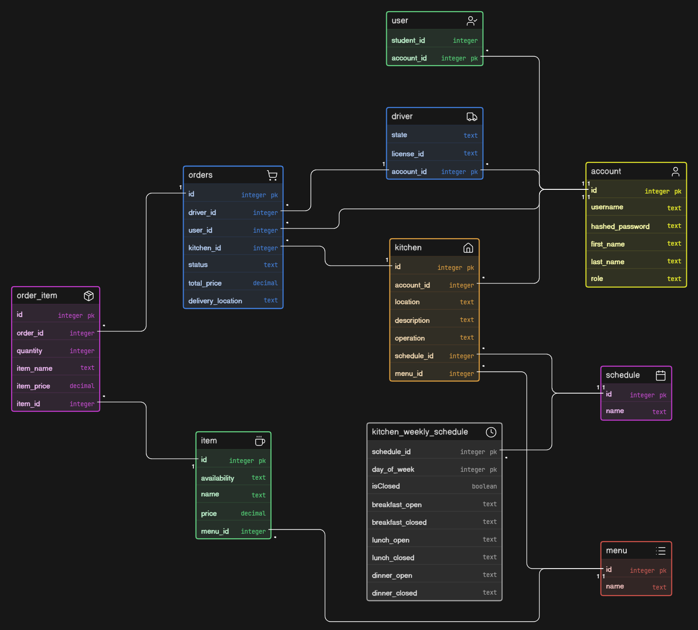

**Registration:**  
Users and drivers register through the website, with users being prompted to enter their student ID in order to register as eligible students, and drivers their drivers license for courier eligibility. Upon registration the session stores the account ID and redirect accounts to their respective account types (i.e user, driver).

User Registration:  
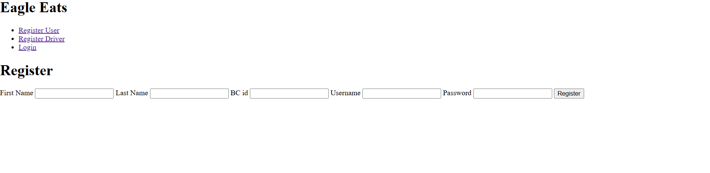

Driver Registration:  
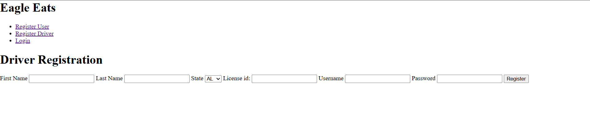

**Login:**  
Users, Drivers, kitchens, and the admin account login through one route. Upon login, account\_id is saved in the session and accounts are rerouted based on their account types.  
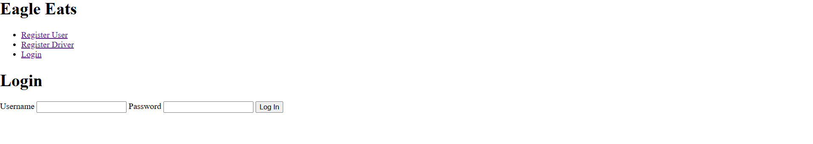  
**Admin Role:**  
Upon login, the admin account is redirected to a dashboard displaying each kitchen as an info drop down. Once selected, admins can view if the kitchen is open or closed (indicated by the green or red icon), its current operations (Breakfast, Lunch, Dinner, Closed) , the menu assigned to it, and finally the schedule assigned to the kitchen.  
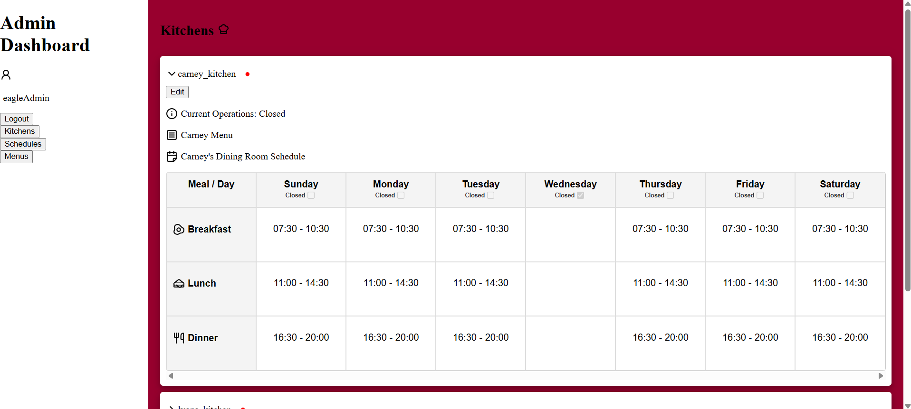

Kitchen states, such as current operations and the open closed state, dynamically change based on the given schedule assigned to a kitchen by the admin. This allows a hands off approach to logistics handling for kitchens and BC dining services. Admins can choose to edit these logistics by clicking on the edit option, redirecting them to the logistics assignment page for the given kitchen. Here the admin can update the running schedule and menu.

\*The image below displays updating the kitchen logistics for carney\_kitchen (from the previous image)  
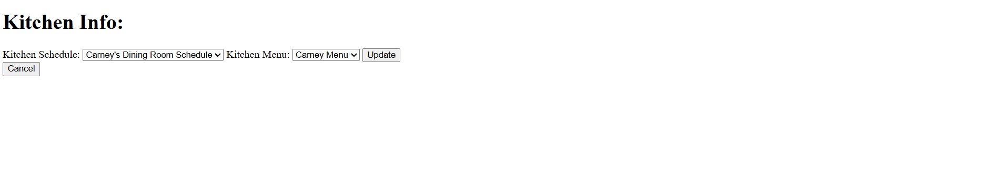  
Admins also have access to viewing, creating ,and editing schedules, as well as viewing menus through the schedule and menu pages respectively. Importantly admins have the ability to view which kitchens schedules are assigned to in the “Assigned To” info section of the drop down.

Schedules page:  
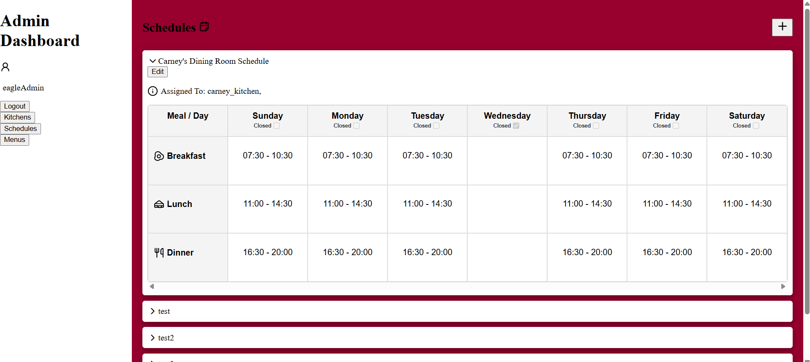

Menus Page:  
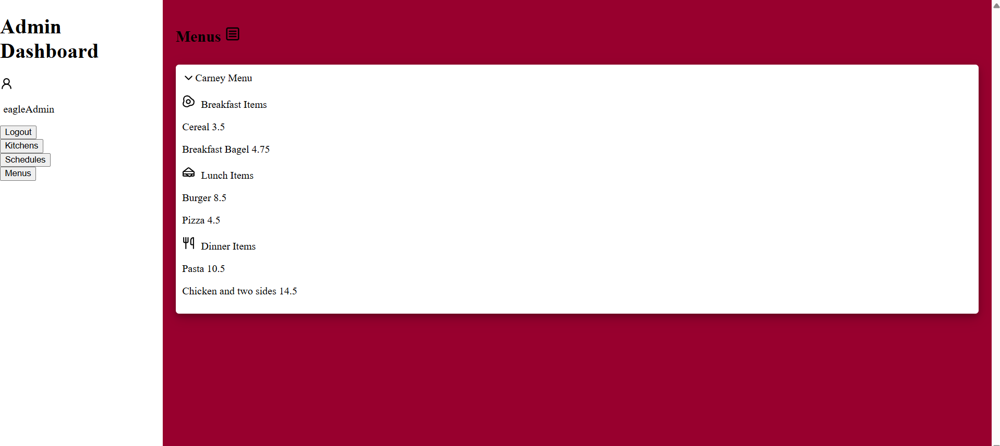

Admins have the ability to create schedules by clicking the “plus” button on the schedule page, redirecting them to the schedule creation page. Here admins can choose to close certain days throughout the week as well as assign time slots for breakfast, lunch, and dinner. Importantly schedules must be named and time slots either kept undefined or both end and start times set definitively to be able to create schedules. If a schedule is invalid upon submission, the admin will be met with an error message describing the invalid issue as well as the specific time slot within the schedule in which this issue arises.This validation layer prevents scheduling inconsistency.

Schedule Creation page:  
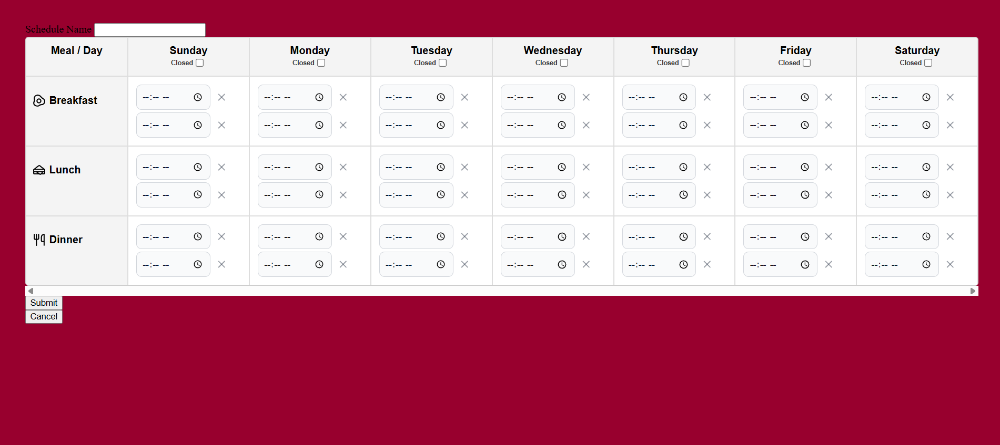

Schedule updating internally redirects to the schedule creation route but instead of creating entries for the schedule, it dynamically updates only elements of the schedule that have changed. This reduces code duplication and prevents redundant database entry updating, allowing the admin to quickly and effectively update schedules on the fly. Upon an update request the schedule form is once again checked against an input validation system for data integrity.

Schedule Updating  
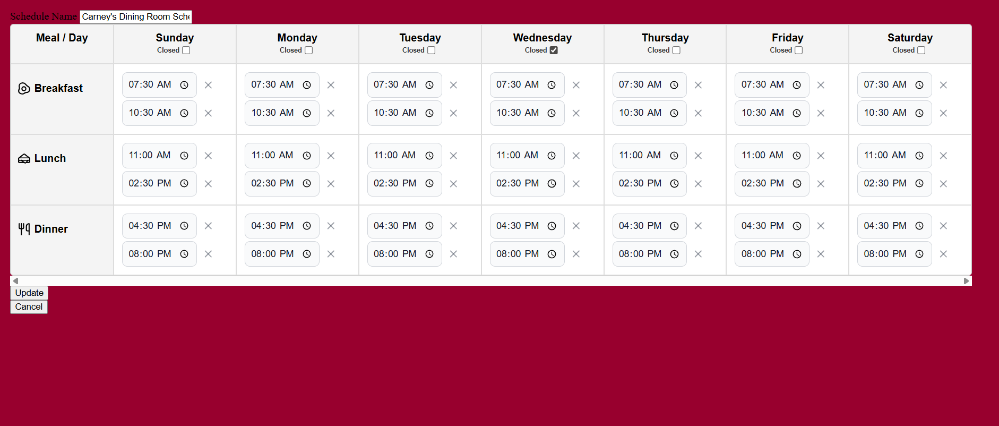

Importantly, with every schedule update, and menu/schedule assignment update for kitchens the backend internally runs a check for the kitchens operation state and menu offering, ensuring that kitchens run their logistics dynamically.

**User Role:**  
Upon logging in users are redirected to their dashboards and displayed a list of open kitchens as well as their menus. Importantly this login request is utilized in the backend to update the logistics state of kitchens so users only view the most uptodate offerings.

Admin Dashboard on the left (showing kitchen logistics), User dashboard on the right (showing congruent kitchen offerings):  
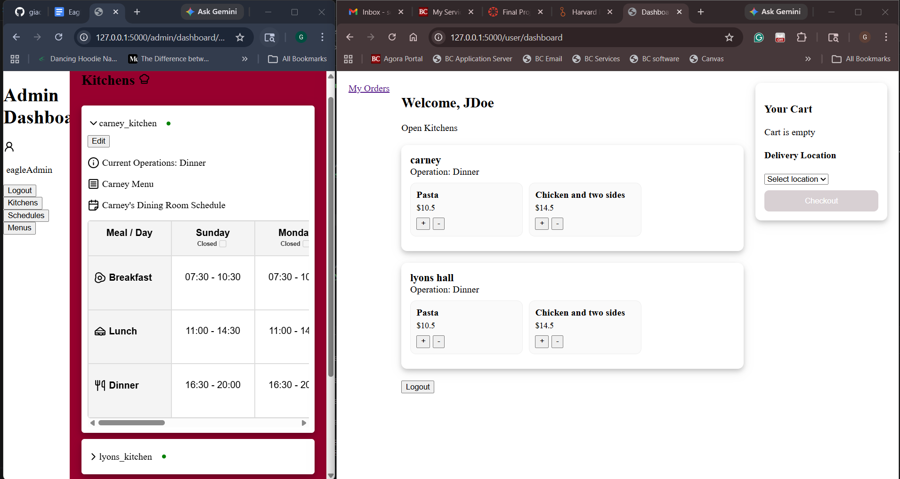

**User Cart:**  
Users can add items to their cart from one kitchen by selecting the “plus” or “minus” option to add or remove an item quantity. Additionally users cannot checkout without at least one item in their cart and a delivery location selected from the dropdown provided. By limiting orders to one kitchen it removes order fulfillment difficulties on the kitchen and delivery side of operations. The user cart works via populating the session with the items and delivery location.

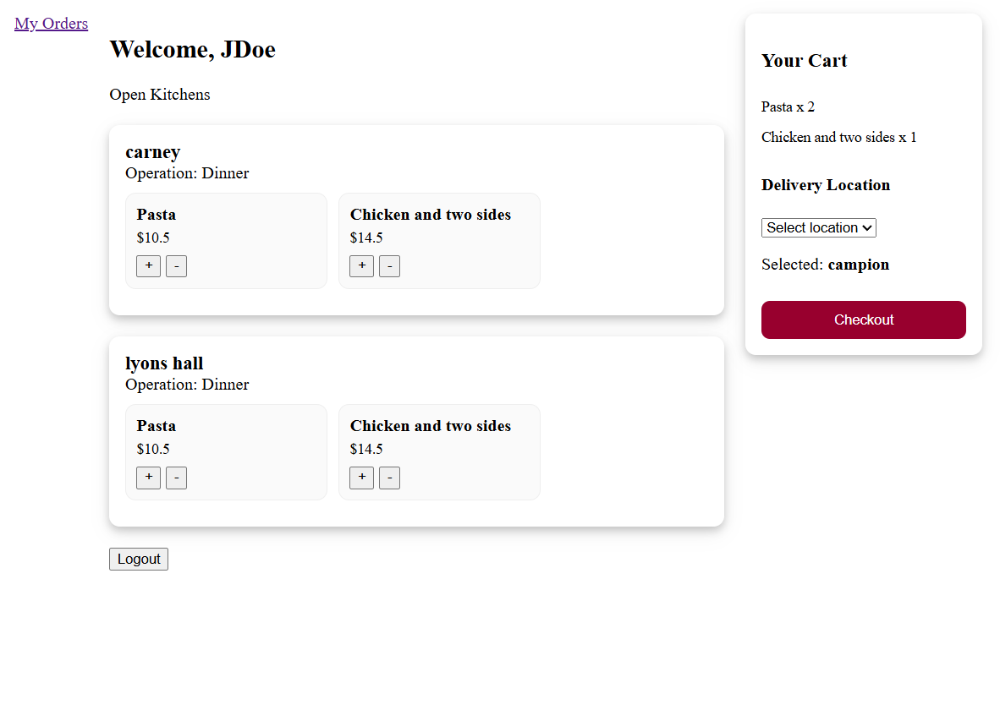  
**Orders Page:**  
Users can navigate to their orders via the order page. Each order will be displayed with its order id, the kitchen fulfilling the order,the delivery location, total bill, and items. The order status is displayed in the top right as either “pending”, “ready”, “delivering”, or “completed”.

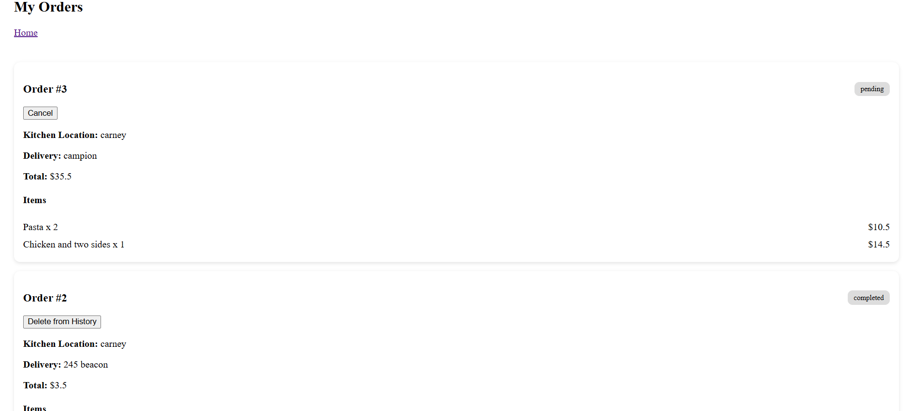

Orders can be cancelled on the fly or deleted from history once “complete”.

**Kitchen Role:**  
Upon logging in, kitchens are able to view incoming orders along with their delivery location, item list, and total bill. Once an order is ready, kitchen staff may mark the order as ready. Ready orders will be visible to drivers. Importantly, orders are only visible to kitchens from which the order is being fulfilled. Kitchens cannot fulfill orders of other kitchens.   
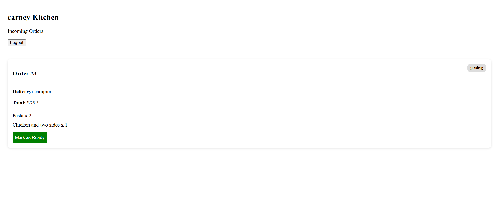  
**Driver Role:**  
Drivers will be able to view orders needing delivery and can pick up orders on the fly. Once an order is picked up it will be moved into their active orders list.  
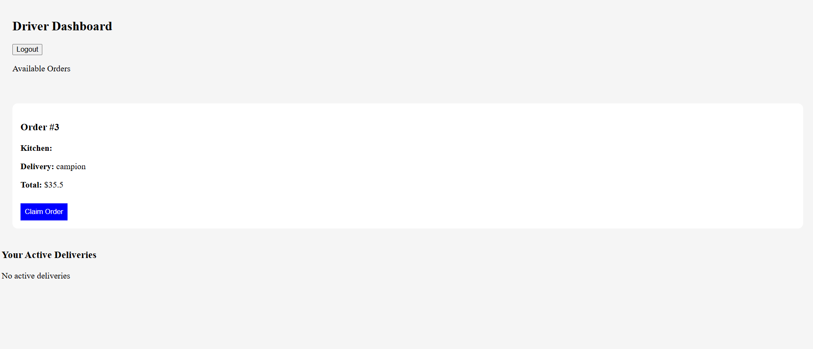  
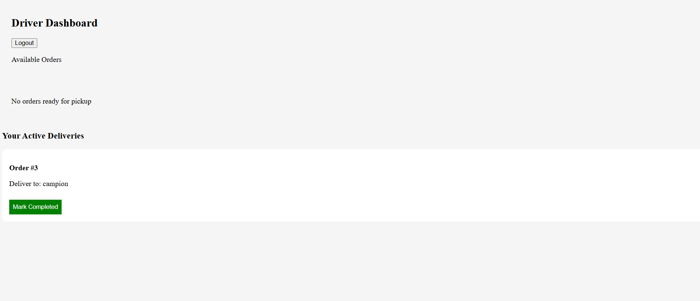

Once an order reaches its destination drivers can mark an order as completed.

**Key Improvements:**  
Developing Eagle Eats offered a unique challenge, primarily in that I was not only developing a food delivery system, but also a kitchen logistics system to provide dynamic offerings and a business logistics layer. Where I found my project to truly be unique lies in this feature as it not only caters towards students wanting food delivery on campus, but provides a solution to Boston College dining services through centralized logistics management that would make implementing a system such as Eagles Eats possible and maintainable. While I would have liked to flesh out the delivery system more, I believe the time spent on the logistics management side of my project is a strength point worth highlighting.

Future improvements include:

- Additional styling through (CSS): The styling implemented in my project leaned more towards fleshing out the logistic management features, and future additions would expand on the delivery system whose minimum styling was meant more to communicate the MVP.  
- Menu creation: Currently adim cannot create menus, an interface for this would be necessary.  
- Managing Deliveries/Orders: More features would need to be implemented to manage orders and deliveries on the kitchen and driver layers.